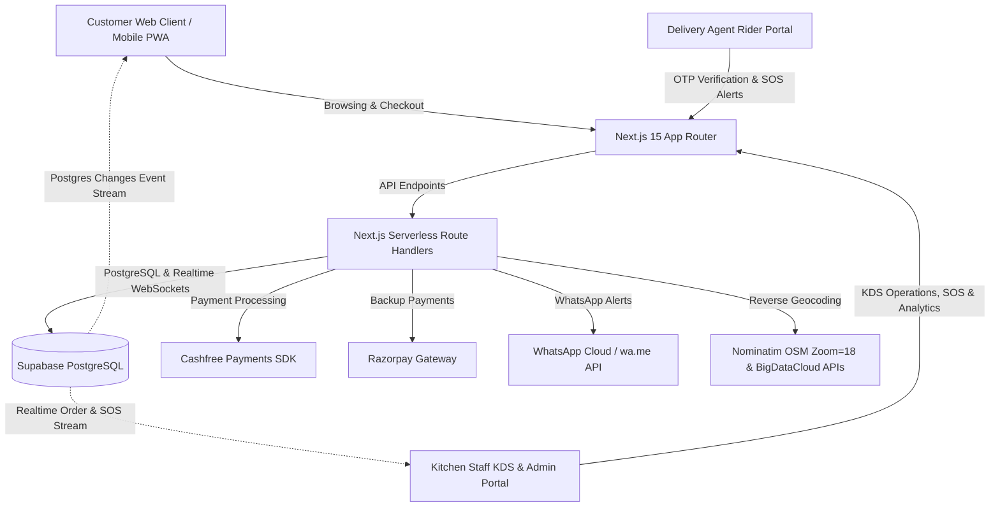
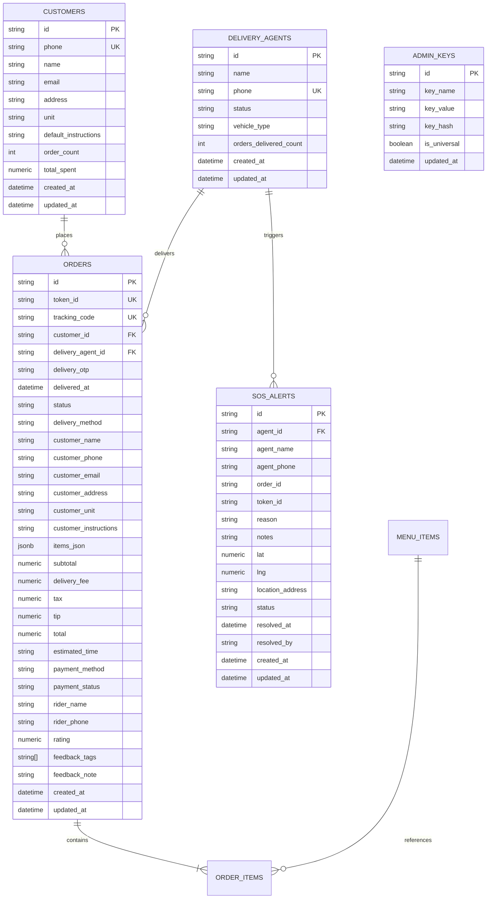

# Product Requirements Document (PRD)

## Project Name: **Zafiroo Gourmet Cafe & Cloud Kitchen Platform**
**Version:** 2.1.0 • **Document Status:** Production Reference • **Target Audience:** Engineering Agents, Product Teams & System Architects

---

## 1. Executive Summary & Vision

### 1.1 Product Overview
**Zafiroo** is a high-performance, full-stack cloud kitchen, artisan cafe, and e-commerce web platform built with **Next.js 15 (App Router)**, **TypeScript**, **Tailwind CSS**, and **Supabase (PostgreSQL & Realtime)**. 

The platform bridges consumer ordering, kitchen operations (KDS), delivery partner logistics, emergency disaster response, and business intelligence into a unified, real-time ecosystem. It features cinematic interactive UI, pinpoint GPS building/house-level reverse geocoding with automatic 1-line address concatenation, multi-gateway payments (Cashfree & Razorpay), live WebSocket-backed order tracking with strictly validated 4-digit doorstep delivery OTP verification, a dedicated Delivery Agent Portal with Emergency SOS assistance, and a comprehensive Kitchen Display System with dual-role authentication.

### 1.2 Core Objectives
- **Consumer Excellence:** Deliver a sub-second, mobile-first ordering experience with rich product visuals, smart item customizers, building/house-level GPS address detection, seamless 1-line address merging, and zero-friction checkout.
- **Kitchen & Operations Optimization:** Provide a real-time digital Kitchen Display System (KDS) with synthesized audio chimes, active SOS disaster siren alerts, 24-hour cycle timer, instant order status pipeline, and studio pickup verification.
- **Delivery Partner Logistics & Safety:** Empower delivery riders with a dedicated mobile-optimized web portal featuring 1-click Google Maps navigation, direct phone dialer, emergency SOS disaster broadcasting, and mandatory 4-digit security OTP verification.
- **Resilient & Realtime Infrastructure:** Ensure seamless operation with Supabase PostgreSQL and Realtime subscriptions, paired with local storage fallbacks for zero-downtime offline continuity.

---

## 2. System Architecture & Tech Stack



### 2.1 Technology Stack Matrix
| Layer | Technology | Purpose / Notes |
| :--- | :--- | :--- |
| **Framework** | Next.js 15.1 (App Router) | SSR, Serverless API Routes, Dynamic Imports |
| **Language** | TypeScript 5.7+ | Strict type checking, robust domain models |
| **Styling** | Tailwind CSS 3.4 + Framer Motion 12 | Custom warm cafe palette, smooth fluid micro-animations |
| **Database** | Supabase (PostgreSQL 15) | Relational store for menu, orders, customers, riders, keys, and SOS alerts |
| **Realtime** | Supabase Realtime Channels | WebSocket broadcast for zero-latency KDS, live tracking, and SOS alerts |
| **Audio Engine** | Web Audio API (Synthesizer) | Polyphonic kitchen order bell chime and dual-tone emergency SOS siren |
| **Payments** | Cashfree PG SDK + Razorpay SDK | Drop-in UPI, cards, net banking, and COD checkout |
| **Geolocation** | OpenStreetMap Nominatim + BigDataCloud | Zoom=18 building/house-level reverse geocoding & Photon POI search |
| **Navigation** | Google Maps Universal URL Scheme | 1-click single-line full address navigation for riders and admins |
| **Notifications** | WhatsApp Cloud / wa.me Link API | Automated OTP delivery notification with click-to-chat fallback |
| **Icons** | Lucide React | Lightweight, consistent iconography |

---

## 3. User Personas & Core Journeys

### 3.1 Customer (Food & Beverage Ordering)
1. Lands on homepage with full-screen cinematic video hero and audio ambience.
2. Explores curated **Best Picks** or navigates to `/menu` for full catalog.
3. Filters by categories (*Coffee, Shakes, Fries, Sandwiches, Pizzas, Desserts, Coolers*) or searches by keyword.
4. Customizes item attributes (*Sweetness, Milk type, Temperature, Portion*) and adds to cart.
5. Opens Cart Drawer, reviews bill breakdown, adds rider tips, and proceeds to checkout.
6. Chooses Delivery or Pickup; taps **Auto-detect Location** (GPS reverse geocodes exact building/street) or searches locality. Enters line 2 (House/Flat No., Building Name, Landmark) which is automatically merged into a clean 1-line address.
7. Pays via Cashfree drop-in UPI or selects Cash on Delivery.
8. Receives immediate Order Token (`#TOK-XXXX-XXX`), strictly generated 4-digit Handover OTP (persisted in database), and live tracking link.
9. Tracks live cooking and delivery stages in real-time, sends location pin to rider via WhatsApp, and rates order upon delivery.

### 3.2 Kitchen Staff (KDS Portal)
1. Logs into `/admin` using Kitchen PIN (`1234` default or Custom Key).
2. Monitors incoming orders in real-time with automatic audio bell alerts.
3. Advances order statuses: `Received` $\rightarrow$ `Preparing` $\rightarrow$ `Packed & Ready` $\rightarrow$ `Dispatched` $\rightarrow$ `Completed`.
4. Handles Studio Pickup orders by verifying customer's 4-digit OTP directly on the order card.
5. Dispatches delivery orders by assigning registered delivery partners.
6. **Receives Emergency SOS Alerts:** If a rider is in distress, a pulsing red SOS Banner flashes across the KDS with a loud siren alarm. Staff opens the SOS Action Center to call the rider, view their exact GPS location, or resolve the crisis.
7. Prints or previews standard formatted thermal bill receipts.

### 3.3 Delivery Agent / Rider
1. Logs into `/admin` selecting **Delivery Agent** tab with registered 10-digit phone number.
2. Views assigned active orders with pickup status, customer name, phone, 1-line exact address, and special courier instructions.
3. Taps **Open Google Maps Navigation** to open the full concatenated 1-line address or GPS pin directly in Google Maps.
4. Taps **Call Customer** or **WhatsApp OTP** for fast communication.
5. **Emergency SOS Assistance:** If stuck in an accident, breakdown, flood, or medical emergency, taps **🚨 SOS Help** to instantly broadcast their live GPS location and issue description to the kitchen.
6. Reaches customer doorstep, collects the customer's 4-digit Delivery OTP, enters it into the portal to verify against the database and complete delivery.

### 3.4 Store Owner / Manager
1. Accesses Business Analytics tab in Admin Portal.
2. Views real-time revenue KPIs (Total Sales, Total Orders, Average Order Value, Delivery vs Pickup ratio).
3. Evaluates category sales breakdowns, best-performing dishes, and courier delivery leaderboards.
4. Manages dynamic menu items (add/edit items, pricing, availability).
5. Registers and manages delivery partners.
6. Updates system Master/Custom Admin keys.

---

## 4. Functional Specifications & Feature Modules

### 4.1 Homepage & Creative Visual Showcase (`/`)
- **Cinematic Video Hero (`ZafirooHero.tsx`):**
  - Continuous cycling of 4 high-definition culinary video scenes (Specialty Latte Art, Gourmet Burger & Fries, Molten Lava Cake, Ice-blended Cold Brew).
  - Smooth 8-second auto-transitions and tap-to-skip interaction.
  - Headline copy, quick category badges, CTA buttons (*Order Online, Whole Menu*).
- **Curated Best Picks Spotlight (`BestPicksSection.tsx`):**
  - Highlighting flagship items with instant "Add to Bag" and modal customizers.
- **Acclaim & Social Proof (`TestimonialsSection.tsx`):**
  - Customer quotes, ratings, culinary philosophy cards.
- **Brand Footer (`ZafirooFooter.tsx`):**
  - Hours of operation, studio address, WhatsApp ordering direct link, social links.

### 4.2 Full Menu Engine (`/menu`)
- **Category Filter Bar:** Horizontal scrolling pill filters with icons for *All, Coffee, Thick Shakes, Crispy Fries, Sandwiches, Pizzas, Desserts, Coolers*.
- **Live Search Input:** Instant filter by name, ingredients, or description.
- **Responsive Dual Layout:**
  - **Mobile:** High-density horizontal list cards (item thumbnail on left, typography in middle, instant "Add" button on right).
  - **Desktop:** Elegant 3-column cards with image zoom hover effects, price badges, and preparation time tags.
- **Item Customization Modal (`MenuDetailModal.tsx`):**
  - Multi-select and single-choice customization for temperature, sweetness, milk preference, portion sizes, and chef preparation instructions.

### 4.3 Slide-Over Cart Drawer (`CartDrawer.tsx`)
- Slide-in sheet from right on desktop / bottom on mobile.
- Real-time quantity controls ($+$, $-$, remove item).
- Free delivery progress indicator (e.g., *Add ₹50 more for FREE Delivery*).
- Tipping selector (₹20, ₹30, ₹50, custom amount).
- Itemized bill breakdown: Subtotal, Delivery Fee (₹40, free $\ge$ ₹299), Taxes (5% GST), Tip, Total.

### 4.4 Geolocation, House/Building Precision & 1-Line Address Concatenation (`src/lib/location.ts`)
- **High-Accuracy GPS Reverse Geocoding (`getCurrentLocationAddress`):**
  - Enforces `enableHighAccuracy: true`, `timeout: 15000`, and `maximumAge: 0`.
  - Provider 1: OpenStreetMap Nominatim with `zoom=18`, `namedetails=1`, and `addressdetails=1` to capture house number, house name, building/apartment name, road/street, sublocality, city, state, and postal code.
  - Provider 2: BigDataCloud Reverse Geocoding Client API fallback.
- **Single-Line Address Formatter (`formatFullOneLineAddress`):**
  - Cleans and concatenates Line 1 (street/area/city) and Line 2 (flat/house number, building name, landmark) into one unified line without duplications.
- **Universal Google Maps Navigation URL Builder (`buildGoogleMapsUrl`):**
  - Constructs 1-click Google Maps search/navigation URLs: `https://www.google.com/maps/search/?api=1&query=${encodeURIComponent(fullOneLineAddress)}` (or exact lat/lng GPS coordinates).
- **Address Autocomplete (`searchAddressQuery`):**
  - Debounced search querying Photon OpenStreetMap POI API.

### 4.5 Checkout & Payment Flow (`CheckoutModal.tsx`)
- **Delivery Mode:** Home Delivery vs Studio Counter Pickup toggle.
- **Form Inputs:** Customer Name, 10-Digit Phone, Email, Auto-detected Street Address (Line 1), Flat/Building/Landmark (Line 2), Courier Instructions, Special Chef Cooking Notes.
- **Payment Method Selector:**
  - **Cashfree PG:** Drop-in UPI SDK seamless checkout with order creation & signature verification.
  - **Razorpay PG:** Alternative gateway option.
  - **Cash on Delivery (COD) / Pay at Counter:** Direct placement with pending/completed payment flag.
- **Strict Database OTP Generation:**
  - Creates unique Order ID (e.g. `ZF-9421-XK7`) and Token ID (`TOK-9421-XK7`).
  - Generates secure random 4-digit Handover OTP (e.g., `4829`) that is persisted in the database `delivery_otp` column.

### 4.6 Live Order Tracking Portal (`/track` & `OrderTrackingModal.tsx`)
- **Lookup Options:** Enter 10-Digit Phone Number (shows all running orders) or specific Order Token ID.
- **Real-Time Synchronisation:**
  - Supabase Realtime WebSocket subscription on `orders` table.
  - 1.5-second automated polling fallback for offline-resilient sync.
- **5-Stage Live Kitchen Pipeline:**
  1. `Order Received` (Ticket registered in database)
  2. `Chef Preparing` (Cooking in progress)
  3. `Thermal Packaged` (Sealed for delivery/pickup)
  4. `Out for Delivery` / `Ready at Studio Counter` (Dispatched with rider or waiting at counter)
  5. `Delivered & Enjoyed` (Completed after OTP verification)
- **4-Digit Verification OTP Card:**
  - Large visible OTP digits for customer to share at doorstep.
  - 1-tap **"Send to my WhatsApp"** button generating pre-formatted WhatsApp message.
- **Courier Partner Card:**
  - Rider name, phone number, direct call button, and 1-tap WhatsApp location sharing.
- **Customer Feedback & Ratings (`OrderCompletionFeedback.tsx`):**
  - 5-Star rating picker, compliment chips, review note textarea.

### 4.7 Kitchen Display System (KDS) & Admin Portal (`/admin`)
- **Authentication & Security:**
  - Universal Master Key support (`ADMIN_MASTER_KEY` environment variable).
  - Database-backed Custom Kitchen PIN (`1234` default, configurable via admin UI).
  - Rate-limited login attempts with lockouts and SHA-256 salted hashing.
- **KDS Live Board:**
  - Live digital clock and 24-hour midnight countdown timer.
  - Synthesized Web Audio API sound chimes on incoming orders.
  - Filter tabs: *All, New Orders, Preparing, Packed, Dispatched, Completed*.
  - Delivery vs Pickup filter toggle.
  - Status progression buttons: *Accept & Start Brewing*, *Mark Thermal Packed*, *Dispatch Delivery Partner*, *Verify Pickup OTP & Handover*, *Cancel Order*.
- **Active SOS Disaster Emergency Banner & Action Center:**
  - Flashing red & gold disaster banner displayed when any rider triggers SOS.
  - Dual-tone emergency siren synthesizer alarm.
  - Admin Action Center modal with 1-tap "Call Rider", "Open Rider Live GPS Pin in Google Maps", and "Resolve & Clear SOS Alert".
- **Delivery Agent / Rider Portal Mode:**
  - Rider login via registered 10-digit phone number.
  - Clean mobile view showing assigned deliveries.
  - 1-tap Google Maps GPS navigation with exact 1-line address and building details.
  - 1-tap customer phone call button & WhatsApp OTP sender (SMS button removed).
  - **🚨 Emergency SOS Button & Disaster Modal:** Allows riders to broadcast immediate alerts with auto-attached live GPS location and categorized issue types (*Breakdown, Heavy Rain/Flood, Traffic Gridlock, Medical, Threat, Other*).
  - **Strict Doorstep 4-Digit OTP Verification:** Validates against the database stored `delivery_otp`. Rejects wrong codes with clear error messages.
- **Printable Thermal Bill Modal (`OriginalBillReceipt.tsx`):** Standard 80mm POS thermal receipt format.

### 4.8 Business Analytics Dashboard
- **Period Filter:** *Today, This Month, All Time*.
- **Metrics Overview Cards:** Total Revenue (₹), Total Orders Count, Average Order Value (AOV), Delivery vs Pickup Breakdown percentage.
- **Category & Dish Performance:** Breakdown of top revenue-generating menu categories and bestsellers.
- **Courier Delivery Leaderboard:** Orders delivered count per rider partner.
- **Comprehensive Searchable Order History Log.**

---

## 5. Database Schema & Data Models

### 5.1 Entity Relationship Diagram



### 5.2 SQL Tables & Indices (PostgreSQL / Supabase)

#### Table: `sos_alerts`
```sql
CREATE TABLE IF NOT EXISTS public.sos_alerts (
    id TEXT PRIMARY KEY,                          -- e.g. SOS-9421-1718
    agent_id TEXT REFERENCES public.delivery_agents(id) ON DELETE SET NULL,
    agent_name TEXT NOT NULL,
    agent_phone TEXT NOT NULL,
    order_id TEXT,
    token_id TEXT,
    reason TEXT NOT NULL,                         -- Breakdown, accident, flood, traffic, medical, threat, other
    notes TEXT,
    lat NUMERIC(10, 6),                           -- Live GPS Latitude
    lng NUMERIC(10, 6),                           -- Live GPS Longitude
    location_address TEXT,
    status TEXT NOT NULL DEFAULT 'active' CHECK (status IN ('active', 'resolved')),
    resolved_at TIMESTAMPTZ,
    resolved_by TEXT,
    created_at TIMESTAMPTZ NOT NULL DEFAULT NOW(),
    updated_at TIMESTAMPTZ NOT NULL DEFAULT NOW()
);
```

---

## 6. API Route Specifications

| Endpoint | Method | Purpose | Request Body / Query | Success Response |
| :--- | :--- | :--- | :--- | :--- |
| `/api/orders` | `GET` | Fetch all active & recent orders for KDS | Query: `?status=...` | `{ success: true, orders: Order[] }` |
| `/api/orders` | `POST` | Create new customer order with OTP | Order creation payload | `{ success: true, order: Order, deliveryOtp: string }` |
| `/api/orders/[id]` | `GET` | Get live tracking details by ID/Phone | URL param (Phone / Token) | `{ success: true, order: Order, orders?: Order[] }` |
| `/api/orders/[id]` | `PATCH` | Update status, feedback, rider details | `{ status, riderName, riderPhone, ... }` | `{ success: true, order: Order }` |
| `/api/menu` | `GET` | Fetch active menu items | None | `{ success: true, menu: MenuItem[] }` |
| `/api/menu` | `POST` | Add/Update dynamic menu item | Menu item object | `{ success: true, item: MenuItem }` |
| `/api/delivery/agents` | `GET` | Fetch all registered delivery riders | None | `{ success: true, agents: DeliveryAgent[] }` |
| `/api/delivery/agents` | `POST` | Register a new delivery agent | `{ name, phone, vehicleType }` | `{ success: true, agent: DeliveryAgent }` |
| `/api/delivery/auth` | `POST` | Rider login authentication | `{ phone }` | `{ success: true, agent: DeliveryAgent, token: string }` |
| `/api/delivery/orders` | `GET` | Fetch orders assigned to rider | Query: `?phone=...` or `?agentId=...` | `{ success: true, orders: Order[] }` |
| `/api/delivery/verify-otp` | `POST` | Strictly verify 4-digit OTP & complete delivery | `{ orderId, otp, agentId, agentPhone }` | `{ success: true, message: string }` |
| `/api/delivery/sos` | `GET` | Fetch all active/recent SOS alerts | None | `{ success: true, alerts: SosAlert[] }` |
| `/api/delivery/sos` | `POST` | Broadcast rider emergency SOS alert | `{ agentId, agentName, reason, lat, lng, ... }` | `{ success: true, alert: SosAlert }` |
| `/api/delivery/sos` | `PATCH` | Resolve and dismiss SOS alert | `{ alertId, resolvedBy, resolutionNotes }` | `{ success: true, message: string }` |
| `/api/admin/auth` | `POST` | Verify Admin Master/Custom PIN | `{ pin, action: 'verify' \| 'change_key' }` | `{ success: true, token: string, isUniversal: boolean }` |
| `/api/cashfree/order` | `POST` | Generate Cashfree PG checkout session | `{ orderId, amount, customerPhone, customerName }` | `{ success: true, paymentSessionId: string }` |
| `/api/cashfree/verify` | `POST` | Verify Cashfree payment signature | `{ orderId }` | `{ success: true, orderStatus: string }` |
| `/api/razorpay/order` | `POST` | Generate Razorpay order token | `{ amount, currency: 'INR', receipt }` | `{ success: true, orderId: string }` |
| `/api/razorpay/verify` | `POST` | Verify Razorpay payment signature | `{ razorpay_order_id, razorpay_payment_id, razorpay_signature }` | `{ success: true }` |
| `/api/orders/cleanup` | `POST` | Purge orders older than 10 days | `{ secretKey }` | `{ success: true, deletedCount: number }` |
| `/api/db-check` | `GET` | Health check Supabase connectivity | None | `{ success: true, isConnected: boolean }` |

---

## 7. Security, Reliability & Performance

### 7.1 Security & Access Control
- **Strict OTP Enforcement:** Doorstep verification OTPs are cryptographically validated against the stored database value. No bypass codes are permitted.
- **Rate Limiting & PIN Throttling:** Strict lockout mechanisms for repeated invalid PIN submissions on `/api/admin/auth`.
- **Salting & Hashing:** Admin PINs stored as salted SHA-256 hashes (`zafiroo_salt_<PIN>`).

### 7.2 Offline Resilience & Data Integrity
- **Dual-Layer Storage:** Every client-side order action updates both Supabase (remote) and browser `localStorage` (local).
- **Graceful Fallbacks:** If external reverse geocoding or payment gateways fail, the app falls back to alternate providers or Cash on Delivery without blocking checkout.

---

## 8. Deployment & Environment Variables

```bash
# App URL
NEXT_PUBLIC_APP_URL=https://zafiroo.com

# Supabase Realtime & PostgreSQL Database
NEXT_PUBLIC_SUPABASE_URL=https://your-project.supabase.co
NEXT_PUBLIC_SUPABASE_ANON_KEY=your-supabase-anon-key
SUPABASE_SERVICE_ROLE_KEY=your-supabase-service-role-key

# Admin Master Recovery Key (Hardened Private Key)
ADMIN_MASTER_KEY=your_secure_master_recovery_pin

# Cashfree Payments Gateway
CASHFREE_APP_ID=your_cashfree_app_id
CASHFREE_SECRET_KEY=your_cashfree_secret_key
NEXT_PUBLIC_CASHFREE_ENV=production # or 'sandbox'

# Razorpay Alternative Gateway (Optional)
RAZORPAY_KEY_ID=your_razorpay_key_id
RAZORPAY_KEY_SECRET=your_razorpay_key_secret

# WhatsApp Ordering Hotline
NEXT_PUBLIC_WHATSAPP_PHONE=919019631104
```

---

*End of Product Requirements Document.*
